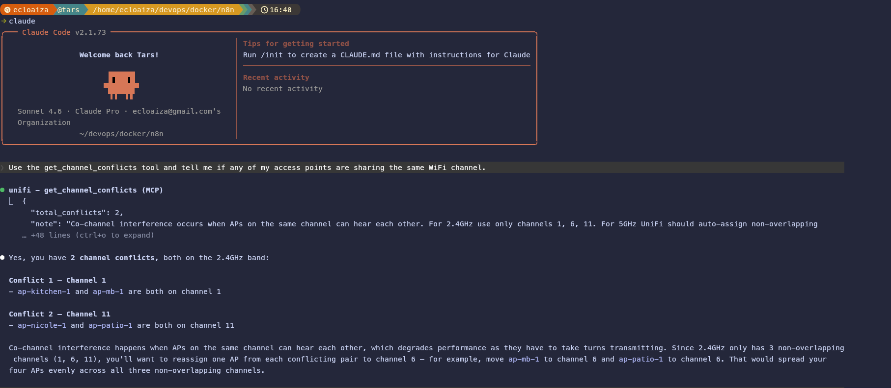

# n8n + Claude Code — Docker Setup Guide

**Author:** Tars (Emmanuel Loaiza)

Self-hosted [n8n](https://n8n.io) workflow automation running via Docker Compose on Ubuntu, integrated with Claude Code CLI running on the host machine.

---

## Table of Contents

1. [Agentic Workflow Overview](#1-agentic-workflow-overview)
2. [n8n Overview](#2-n8n-overview)
3. [MCP Server Overview](#3-mcp-server-overview)
4. [Prerequisites](#4-prerequisites)
5. [Architecture Overview](#5-architecture-overview)
6. [Setup Guide](#6-setup-guide)
   - [6.1 Deploy n8n with Docker](#61-deploy-n8n-with-docker)
   - [6.2 Install Claude Code on Ubuntu](#62-install-claude-code-on-ubuntu)
   - [6.3 Configure n8n SSH Credentials](#63-configure-n8n-ssh-credentials)
   - [6.4 Test the Connection](#64-test-the-connection)
7. [Use Case - UniFi Network](#7-use-case---unifi-network)
8. [Session Management](#8-session-management)
9. [Troubleshooting](#9-troubleshooting)

---

## 1. Agentic Workflow Overview

This project wasn't built by writing code from scratch in an editor. It was built through **agentic workflow** — a collaborative loop where I described what I wanted in plain language and Claude Code handled the execution: writing configs, creating workflows, wiring up MCP servers, and generating this documentation.

### What "agentic" means here

An **agentic workflow** is one where the AI doesn't just answer questions — it takes actions. Instead of Claude responding with "here's how you might do that," it actually does it: creates files, calls APIs, reads logs, modifies configs, and iterates until the goal is met.

In this setup, that looks like:

```
Me (plain language goal)
        │
        ▼
 Claude Code CLI (the agent)
        │
        ├──► reads/writes files on disk
        ├──► calls MCP tools (UniFi, Gmail, Calendar, n8n)
        ├──► executes shell commands on the host
        ├──► creates and validates n8n workflows via n8n-mcp
        └──► updates this documentation in real time
```

### How this project was built

**1. Infrastructure first — with Claude driving**

The Docker setup (`docker-compose.yml`, `.env`, directory structure) was assembled through conversation. I described the goal — "n8n running in Docker, accessible to Claude Code on the host, with a shared folder between them" — and Claude generated the configuration, explained each decision, and flagged security considerations like never committing `.env`.

**2. MCP servers as Claude's reach**

Each MCP server extends what Claude can directly act on. To build and test the UniFi workflow, I didn't log into the UniFi controller manually — Claude used the `mcp__unifi` tools to query the live network, verify data shapes, and validate that the n8n workflow was returning the right fields.

The same pattern applied to n8n itself: the `mcp__n8n-mcp` server let Claude create, validate, deploy, and test n8n workflows without me touching the n8n UI.

**3. Iterative workflow construction**

The UniFi MCP Server workflow (Section 7) was built in a loop:

- I described the tool I wanted (e.g., "give Claude a way to check which APs have high TX retries")
- Claude used `mcp__n8n-mcp__search_nodes` to find the right n8n nodes
- It drafted the workflow JSON, validated it with `mcp__n8n-mcp__validate_workflow`
- Deployed it live with `mcp__n8n-mcp__n8n_create_workflow`
- Then called the tool through the MCP server to verify the output

**4. Documentation as a first-class output**

This README was written by Claude as part of the same session — not as an afterthought. As each component was built and tested, Claude updated the documentation to reflect actual behavior. The section on expected output examples (Section 7) was written against real tool responses, not hypothetical ones.

### Why this matters

The result is a system that is both the product and the tool used to build it. Claude Code built the n8n MCP server. The n8n MCP server is now one of Claude's tools. That kind of recursive, self-extending capability is what makes agentic workflow qualitatively different from traditional development.

> The agent didn't just help write code. It helped design the system, configure the infrastructure, test the integrations, and document the result — all from a conversation.

---

## 2. n8n Overview

Okay, imagine you have a bunch of apps you use every day — like Gmail, Google Calendar, Slack, a smart home app, whatever. Normally, these apps don't talk to each other. You have to do everything yourself: copy this, paste that, check this, send that.

**n8n** is like a magic robot helper that connects all those apps together and does the boring stuff for you automatically.

> Think of n8n like a set of LEGO instructions. You snap pieces together — "when THIS happens, do THAT" — and n8n follows the instructions every time, all by itself.

**Here's a simple example:**

> "Every morning at 8am, check my email for any orders that came in overnight, add them to a spreadsheet, and send me a Slack message with a summary."

You set that up **once** in n8n, and it just... does it. Forever. While you sleep.

**How does it work?**

n8n uses something called **workflows**. A workflow is just a chain of steps:

1. **Trigger** — something that starts the workflow (like "a new email arrives" or "every hour")
2. **Nodes** — the actions that happen (like "read the email", "add a row to Google Sheets", "send a Slack message")
3. **Connections** — the arrows between steps that say "do this, then do that"

**Why is this cool?**

- No coding required for simple stuff (just drag and drop)
- It runs on your own computer or server, so **your data stays private**
- It can connect to hundreds of apps (Google, GitHub, Slack, databases, webhooks, and way more)
- It can also run code (JavaScript or Python) when you need something custom

**In this setup:**

We run n8n inside Docker (a little isolated box on your computer) so it's always on, always ready, and doesn't mess with anything else on your system. We then connect it to Claude (the AI) so that Claude can trigger automations or respond to things n8n detects on your network.

---

## 3. MCP Server Overview

Okay, so imagine you have a really smart helper (that's Claude — the AI). Now imagine you want that helper to actually **do things** for you — like check your calendar, read your emails, look at your network devices, or control other apps — not just talk about them.

That's where an **MCP server** comes in.

**MCP** stands for **Model Context Protocol**. It's basically a special plug-in system that lets Claude reach outside of itself and connect to real tools and services.

Think of it like this:

> Claude is the brain. MCP servers are the hands.

Without MCP, Claude can only read what you type and type back. With MCP servers connected, Claude can actually **go do stuff** — look up live data, run commands, fetch files, and more.

**How does it work? (super simple version)**

1. You set up an MCP server for a tool you want Claude to use (like Google Calendar, Gmail, or your UniFi network).
2. That server sits there waiting, like a translator between Claude and the tool.
3. When Claude needs to do something (like "check my schedule"), it talks to the MCP server, which talks to the actual app, and brings the answer back.

**In this setup, we use MCP servers for things like:**

- Checking who's connected to the UniFi network (`mcp__unifi`)
- Reading and drafting Gmail messages (`mcp__claude_ai_Gmail`)
- Creating and managing Google Calendar events (`mcp__claude_ai_Google_Calendar`)

So basically: MCP servers = superpowers for Claude. They let it interact with the real world instead of just chatting.

---

## 4. Prerequisites

Before starting, ensure the following are installed and available on your Ubuntu host:

| Requirement | Version | Notes |
|---|---|---|
| Ubuntu | 20.04+ | Host machine |
| Docker Engine | 24.0+ | [Install guide](https://docs.docker.com/engine/install/ubuntu/) |
| Docker Compose | v2.0+ | Included with Docker Desktop or install the plugin |
| Node.js | 18+ | Required for Claude Code |
| npm | 9+ | Comes with Node.js |
| Git | any | For cloning and managing configs |

**Install Docker on Ubuntu:**

```bash
# Remove old versions
sudo apt-get remove docker docker-engine docker.io containerd runc

# Install dependencies
sudo apt-get update
sudo apt-get install -y ca-certificates curl gnupg lsb-release

# Add Docker's official GPG key
sudo mkdir -p /etc/apt/keyrings
curl -fsSL https://download.docker.com/linux/ubuntu/gpg | \
  sudo gpg --dearmor -o /etc/apt/keyrings/docker.gpg

# Add the Docker repository
echo \
  "deb [arch=$(dpkg --print-architecture) signed-by=/etc/apt/keyrings/docker.gpg] \
  https://download.docker.com/linux/ubuntu $(lsb_release -cs) stable" | \
  sudo tee /etc/apt/sources.list.d/docker.list > /dev/null

# Install Docker Engine
sudo apt-get update
sudo apt-get install -y docker-ce docker-ce-cli containerd.io docker-compose-plugin

# Add your user to the docker group (avoid needing sudo)
sudo usermod -aG docker $USER
newgrp docker
```

**Install Node.js (via nvm — recommended):**

```bash
curl -o- https://raw.githubusercontent.com/nvm-sh/nvm/v0.39.7/install.sh | bash
source ~/.bashrc
nvm install 20
nvm use 20
node --version
```

---

## 5. Architecture Overview

```
┌─────────────────────────────────────────────────────────────────┐
│                        Ubuntu Host Machine                      │
│                                                                 │
│   ┌─────────────────────────────────┐                           │
│   │        Docker Engine            │                           │
│   │                                 │                           │
│   │  ┌──────────────────────────┐   │                           │
│   │  │    n8n Container         │   │   ┌─────────────────┐     │
│   │  │                          │   │   │  Claude Code    │     │
│   │  │  image: n8nio/n8n:latest │   │   │  CLI (host)     │     │
│   │  │  port: 5678              │◄──┼───►                 │     │
│   │  │                          │   │   │  $ claude       │     │
│   │  │  volumes:                │   │   └────────┬────────┘     │
│   │  │  ./n8n_data → .n8n/      │   │            │              │
│   │  │  ./shared   → shared/    │   │            │ reads/writes │
│   │  │                          │   │            ▼              │
│   │  │  extra_hosts:            │   │   ┌─────────────────┐     │
│   │  │  host.docker.internal    │   │   │  ./shared/      │     │
│   │  │  → host-gateway          │   │   │  (shared vol.)  │     │
│   │  └──────────────────────────┘   │   └─────────────────┘     │
│   │                                 │                           │
│   │  Docker network: frontend       │                           │
│   └─────────────────────────────────┘                           │
│                                                                 │
│   ┌──────────────────────────────────────────────────────────┐  │
│   │                    .env file                             │  │
│   │  N8N_HOST, N8N_PORT, N8N_ENCRYPTION_KEY, WEBHOOK_URL     │  │
│   │  N8N_BASIC_AUTH_USER / PASSWORD, GENERIC_TIMEZONE        │  │
│   │  UNIFI_USER, UNIFI_PASS                                  │  │
│   └──────────────────────────────────────────────────────────┘  │
└─────────────────────────────────────────────────────────────────┘

         Browser ──► http://localhost:5678 ──► n8n UI
```

**How it works:**
- n8n runs inside Docker and is accessible at `http://localhost:5678`
- The `host.docker.internal` alias lets the container call the Ubuntu host (where Claude Code runs)
- The `./shared` folder is mounted in both the container (`/home/node/shared`) and readable by Claude Code on the host, enabling file-based communication between n8n workflows and Claude
- Workflow data, credentials, and the SQLite database are persisted in `./n8n_data`
- `UNIFI_USER` and `UNIFI_PASS` are passed into the container via the `environment:` block so n8n workflows can interact with a UniFi controller
- `N8N_BLOCK_ENV_ACCESS_IN_NODE=false` allows workflow nodes to read those env vars via `$env` expressions
- The external `frontend` Docker network allows integration with reverse proxies (e.g. Nginx, Traefik)

**Directory structure:**

```
n8n/
├── docker-compose.yml       # Service definition
├── .env                     # Environment variables (do NOT commit)
├── n8n_data/                # Persisted n8n data (DB, credentials, logs)
│   ├── database.sqlite
│   └── nodes/
├── shared/                  # Shared volume between host and container
└── workflows/               # Exported workflow JSON backups
```

---

## 6. Setup Guide

### 6.1 Deploy n8n with Docker

**Step 1 — Create the external Docker network:**

```bash
docker network create frontend
```

**Step 2 — Clone or create the project directory:**

```bash
mkdir -p ~/devops/docker/n8n && cd ~/devops/docker/n8n
```

**Step 3 — Create the `.env` file:**

```bash
cat > .env <<EOF
# n8n
N8N_BASIC_AUTH_ACTIVE=true
N8N_BASIC_AUTH_USER=admin
N8N_BASIC_AUTH_PASSWORD=your-strong-password-here
N8N_HOST=localhost
N8N_PORT=5678
N8N_PROTOCOL=http
WEBHOOK_URL=http://localhost:5678/
GENERIC_TIMEZONE=America/New_York
N8N_COMMUNITY_PACKAGES_ENABLED=true
N8N_ENCRYPTION_KEY=your-random-encryption-key-here
N8N_API_DISABLED=false

# UniFi integration (used by n8n workflows)
UNIFI_USER=your-unifi-username
UNIFI_PASS=your-unifi-password
EOF
```

> **Security:** Never commit `.env` to version control. Add it to `.gitignore`.

Generate a strong encryption key:

```bash
openssl rand -hex 32
```

**Step 4 — Create the `docker-compose.yml`:**

```yaml
services:
  n8n:
    image: docker.n8n.io/n8nio/n8n:latest
    container_name: n8n
    restart: unless-stopped
    env_file:
      - .env
    environment:
      - N8N_BLOCK_ENV_ACCESS_IN_NODE=false
      - UNIFI_USER=${UNIFI_USER}
      - UNIFI_PASS=${UNIFI_PASS}
    ports:
      - "5678:5678"
    volumes:
      - ./n8n_data:/home/node/.n8n
      # Mount a local folder so Claude Code can read/write shared files
      - ./shared:/home/node/shared
    # Allow n8n to reach Claude Code CLI running on the host machine
    extra_hosts:
      - "host.docker.internal:host-gateway"

networks:
  frontend:
    external: true
```

> `N8N_BLOCK_ENV_ACCESS_IN_NODE=false` allows n8n workflow nodes to access environment variables (like `UNIFI_USER`/`UNIFI_PASS`) via `$env` expressions. The `env_file` loads base config while the `environment` block explicitly forwards specific variables into the container.

**Step 5 — Create data directories and start:**

```bash
mkdir -p n8n_data shared
docker compose up -d
```

**Step 6 — Verify it's running:**

```bash
docker compose ps
docker compose logs -f n8n
```

Access n8n at: **http://localhost:5678**

**Common Docker Compose commands:**

```bash
docker compose up -d          # Start in background
docker compose down           # Stop and remove containers
docker compose restart n8n    # Restart the n8n service
docker compose pull n8n       # Pull the latest image
docker compose logs -f n8n    # Follow logs
```

---

### 6.2 Install Claude Code on Ubuntu

Claude Code is Anthropic's official CLI tool for AI-assisted development.

**Step 1 — Ensure Node.js 18+ is installed** (see Prerequisites above).

**Step 2 — Install Claude Code globally:**

```bash
npm install -g @anthropic-ai/claude-code
```

**Step 3 — Verify the installation:**

```bash
claude --version
```

**Step 4 — Authenticate with your Anthropic API key:**

```bash
claude
```

On first run, Claude Code will prompt you to authenticate. Follow the browser-based OAuth flow or set your API key directly:

```bash
export ANTHROPIC_API_KEY=your-api-key-here
```

To make it permanent, add it to your shell profile:

```bash
echo 'export ANTHROPIC_API_KEY=your-api-key-here' >> ~/.bashrc
source ~/.bashrc
```

**Step 5 — Test Claude Code:**

```bash
claude --print "Hello, are you working?"
```

> Claude Code runs on the **host machine**, not inside Docker. n8n workflows reach it via `host.docker.internal`.

---

### 6.3 Configure n8n SSH Credentials

To allow n8n to execute commands on the host (e.g., run Claude Code), set up SSH access from the container to the host.

**Step 1 — Enable SSH on the Ubuntu host:**

```bash
sudo apt-get install -y openssh-server
sudo systemctl enable ssh
sudo systemctl start ssh
```

**Step 2 — Generate an SSH key pair for n8n to use:**

```bash
ssh-keygen -t ed25519 -C "n8n-to-host" -f ~/.ssh/n8n_host_key -N ""
```

**Step 3 — Authorize the key for your user:**

```bash
cat ~/.ssh/n8n_host_key.pub >> ~/.ssh/authorized_keys
chmod 600 ~/.ssh/authorized_keys
```

**Step 4 — Get the private key content:**

```bash
cat ~/.ssh/n8n_host_key
```

Copy the full output (including `-----BEGIN...` and `-----END...` lines).

**Step 5 — Add SSH credentials in n8n:**

1. Open n8n at `http://localhost:5678`
2. Go to **Settings → Credentials → Add Credential**
3. Search for **SSH**
4. Fill in:
   - **Host:** `host.docker.internal`
   - **Port:** `22`
   - **Username:** your Ubuntu username (e.g., `ecloaiza`)
   - **Authentication:** Private Key
   - **Private Key:** paste the content from Step 4
5. Save the credential

---

### 6.4 Test the Connection

**Test SSH from inside the n8n container:**

```bash
docker exec -it n8n sh -c \
  "ssh -o StrictHostKeyChecking=no ecloaiza@host.docker.internal 'echo Connection OK'"
```

**Test via an n8n workflow:**

1. Create a new workflow in n8n
2. Add an **SSH** node
3. Select your SSH credential
4. Set command: `claude --version`
5. Execute — you should see the Claude Code version in the output

**Test the shared folder:**

```bash
# From the host
echo "hello from host" > ./shared/test.txt

# From inside the container
docker exec -it n8n cat /home/node/shared/test.txt
```

---

## 7. Use Case - UniFi Network

This workflow (`workflows/UniFi MCP Server.json`) turns n8n into a **live MCP server** that gives Claude direct read access to your UniFi network. Once active, Claude can answer real questions about your network without you having to log into the UniFi controller yourself.

**Workflow name:** `UniFi MCP Server`
**Trigger type:** MCP Server Trigger (webhook-based, always-on)
**Status:** Active

---

### How it works

The workflow exposes 4 tools through the MCP protocol. Each tool logs into the UniFi controller at `https://router.home.elikesbikes.com` using the `UNIFI_USER` and `UNIFI_PASS` environment variables from your `.env` file, makes an API call, and returns structured data back to Claude.

```
Claude (MCP client)
       │
       ▼
MCP Server Trigger (n8n webhook)
       │
       ├──► get_connected_clients
       ├──► get_error_logs
       ├──► get_high_tx_retries
       └──► get_channel_conflicts
                    │
                    ▼
         UniFi Controller API
         router.home.elikesbikes.com
```

---

### Tools

#### `get_connected_clients`
Returns every device currently connected to the network.

**What it returns per client:**

| Field | Description |
|---|---|
| `name` | Device name or hostname |
| `ip` | Current IP address |
| `mac` | MAC address |
| `type` | `Wired` or `WiFi` |
| `network` | SSID (for WiFi) or `Wired` |
| `signal` | Signal strength in dBm (WiFi only) |
| `manufacturer` | OUI vendor lookup |

**Example Claude prompts:**
- *"How many devices are on my network right now?"*
- *"Is my laptop connected to WiFi?"*
- *"List everything on the wired network."*

---

#### `get_error_logs`
Returns alarms and alerts from the UniFi controller (up to 50 most recent).

**What it returns per log entry:**

| Field | Description |
|---|---|
| `time` | Human-readable timestamp |
| `type` | Alarm key/type |
| `message` | Alert message text |
| `severity` | `active` or `resolved` |
| `device` | AP, gateway, or switch that triggered it |

**Example Claude prompts:**
- *"Are there any active network alerts?"*
- *"Did anything go wrong on the network today?"*
- *"Show me unresolved alarms."*

---

#### `get_high_tx_retries`
Scans all access points and flags any with TX retry rates above **20%** — the same threshold the UniFi UI uses to indicate poor wireless performance.

**What it returns per problematic AP:**

| Field | Description |
|---|---|
| `ap_name` | Access point name |
| `mac` | AP MAC address |
| `radio` | Radio band (e.g. `ng`, `na`, `6e`) |
| `channel` | Channel number |
| `tx_packets` | Total transmitted packets |
| `tx_retries` | Number of retried packets |
| `retry_percent` | Retry rate as a percentage |

**Example Claude prompts:**
- *"Which access points have bad WiFi performance?"*
- *"Are there any TX retry issues on my APs?"*
- *"Why is the WiFi slow in the office?"*

---

#### `get_channel_conflicts`
Scans all access points and identifies co-channel interference — cases where multiple APs share the same channel and can hear each other, degrading WiFi performance.

**What it returns per conflict:**

| Field | Description |
|---|---|
| `channel_key` | Unique key combining band and channel (e.g. `2.4GHz_ch6`) |
| `band` | `2.4GHz`, `5GHz`, or `6GHz` |
| `channel` | Channel number |
| `ap_count` | Number of APs sharing this channel |
| `access_points` | List of APs on the channel (name, MAC, tx_power) |

> For 2.4GHz, only channels 1, 6, and 11 are non-overlapping. For 5GHz, UniFi should auto-assign non-overlapping channels.

**Example Claude prompts:**
- *"Are there any channel conflicts on my WiFi network?"*
- *"Which APs are causing co-channel interference?"*
- *"Why is my 2.4GHz WiFi slow — are there channel collisions?"*
- *"Do any of my access points share the same channel?"*

---

### Importing the workflow

```bash
# From the n8n UI
# 1. Go to Workflows → Import from file
# 2. Select: workflows/UniFi MCP Server.json
# 3. Save and activate

# Or via CLI
docker exec n8n n8n import:workflow --input=/home/node/shared/UniFi\ MCP\ Server.json
```

> Make sure `UNIFI_USER` and `UNIFI_PASS` are set in your `.env` file and that `N8N_BLOCK_ENV_ACCESS_IN_NODE=false` is configured — the workflow reads these at runtime via `$env`.

---

### Testing the Workflow

Once the workflow is imported and active, you can test each tool directly from Claude Code CLI. Claude uses the MCP server to call the tools and return live network data.

**Step 1 — Confirm the MCP server is configured:**

Verify that the UniFi MCP server is registered in your Claude Code config:

```bash
cat ~/.claude.json | grep -A5 unifi
```

You should see an entry pointing to your n8n MCP webhook URL. If not, add it:

```json
{
  "mcpServers": {
    "unifi": {
      "type": "sse",
      "url": "http://localhost:5678/mcp/<workflow-id>/sse"
    }
  }
}
```

> Get the `<workflow-id>` by opening the workflow in the n8n UI and clicking the **MCP Server Trigger** node — the URL is shown in the node panel.

**Step 2 — Verify Claude can see the UniFi tools:**

Open Claude Code and check that the tools are available:

```bash
claude
```

Then in the interactive session, ask:

```
What MCP tools do you have access to?
```

You should see `get_connected_clients`, `get_error_logs`, `get_high_tx_retries`, and `get_channel_conflicts` listed under the UniFi server.

**Step 3 — Test the tools interactively:**

Because MCP tool calls require your approval, you must run Claude in interactive mode. Start a session:

```bash
claude
```

Then ask one of the following prompts and approve the tool call when prompted:

**Test `get_connected_clients`:**
```
Use the get_connected_clients tool and tell me how many devices are on my network right now.
```

**Test `get_error_logs`:**
```
Use the get_error_logs tool and tell me if there are any active alarms on my UniFi network.
```

**Test `get_high_tx_retries`:**
```
Use the get_high_tx_retries tool and tell me which access points have poor WiFi performance.
```

**Test `get_channel_conflicts`:**
```
Use the get_channel_conflicts tool and tell me if any of my access points are sharing the same WiFi channel.
```

**Run a combined diagnostic:**
```
Give me a full network health summary: how many devices are connected, any active alarms, any APs with high TX retries, and any channel conflicts.
```

**For deeper follow-up analysis:**
```
Is my laptop connected to WiFi? What signal strength is it showing?
Did anything go wrong on the network in the last 24 hours?
Why might the WiFi be slow near the office?
```

Claude will prompt you to approve each tool call before executing it, then respond with live network data.

**Expected output examples:**



```json
// get_connected_clients (truncated)
{
  "clients": [
    { "name": "MacBook-Pro", "ip": "192.168.1.42", "mac": "aa:bb:cc:dd:ee:ff",
      "type": "WiFi", "network": "HomeNet", "signal": -55, "manufacturer": "Apple" },
    { "name": "NAS", "ip": "192.168.1.10", "mac": "11:22:33:44:55:66",
      "type": "Wired", "network": "Wired", "signal": null, "manufacturer": "Synology" }
  ]
}

// get_high_tx_retries (clean network — no results)
{ "high_retry_aps": [] }

// get_high_tx_retries (problem detected)
{
  "high_retry_aps": [
    { "ap_name": "Office AP", "mac": "aa:bb:cc:11:22:33", "radio": "ng",
      "channel": 6, "tx_packets": 50000, "tx_retries": 12000, "retry_percent": 24 }
  ]
}

// get_channel_conflicts (clean — no conflicts)
{ "total_conflicts": 0, "conflicts": [] }

// get_channel_conflicts (conflict detected)
{
  "total_conflicts": 1,
  "conflicts": [
    {
      "channel_key": "2.4GHz_ch6",
      "band": "2.4GHz",
      "channel": 6,
      "ap_count": 2,
      "access_points": [
        { "ap_name": "Living Room AP", "mac": "aa:bb:cc:11:22:33", "band": "2.4GHz", "channel": 6, "tx_power": 20 },
        { "ap_name": "Kitchen AP",     "mac": "dd:ee:ff:44:55:66", "band": "2.4GHz", "channel": 6, "tx_power": 20 }
      ]
    }
  ]
}

---
```
## 8. Session Management

**n8n container lifecycle:**

```bash
# Start
docker compose up -d

# Stop (data is preserved in n8n_data/)
docker compose down

# Stop and remove all data (destructive)
docker compose down -v

# Restart after config changes
docker compose down && docker compose up -d

# Update to latest n8n image
docker compose pull n8n
docker compose up -d
```

**Check container status:**

```bash
docker compose ps
docker stats n8n
```

**Backup n8n data:**

```bash
# Backup the entire data directory
tar -czf n8n_backup_$(date +%Y%m%d).tar.gz n8n_data/

# Export all workflows to JSON
docker exec n8n n8n export:workflow --all --output=/home/node/shared/
```

**Restore from backup:**

```bash
docker compose down
tar -xzf n8n_backup_20240101.tar.gz
docker compose up -d
```

**Auto-start on system boot:**

The `restart: unless-stopped` policy in `docker-compose.yml` ensures n8n restarts automatically after a reboot, as long as Docker itself starts on boot:

```bash
sudo systemctl enable docker
```

---

## 9. Troubleshooting

**n8n container won't start:**

```bash
# Check logs for errors
docker compose logs n8n

# Verify the frontend network exists
docker network ls | grep frontend

# Create it if missing
docker network create frontend
```

**Port 5678 already in use:**

```bash
sudo lsof -i :5678
# Kill the conflicting process or change the port in docker-compose.yml
```

**Cannot reach `host.docker.internal` from container:**

```bash
# Verify the extra_hosts entry is in docker-compose.yml
docker exec -it n8n ping host.docker.internal

# On older Docker versions, manually find the host gateway IP
docker network inspect bridge | grep Gateway
```

**SSH connection refused from n8n to host:**

```bash
# Check SSH is running on the host
sudo systemctl status ssh

# Test SSH manually
ssh -i ~/.ssh/n8n_host_key -o StrictHostKeyChecking=no \
  ecloaiza@host.docker.internal "echo OK"

# Check authorized_keys permissions
ls -la ~/.ssh/authorized_keys  # should be 600
```

**Claude Code not found after SSH:**

SSH sessions may not load your full shell profile. Use the absolute path:

```bash
which claude   # find the path, e.g. /home/ecloaiza/.nvm/versions/node/v20.0.0/bin/claude

# Use full path in n8n SSH node
/home/ecloaiza/.nvm/versions/node/v20.0.0/bin/claude --print "Hello"
```

Or add to `/etc/environment` to make it available system-wide:

```bash
echo 'PATH="/home/ecloaiza/.nvm/versions/node/v20.0.0/bin:$PATH"' | sudo tee -a /etc/environment
```

**n8n encryption key error after restart:**

If you change `N8N_ENCRYPTION_KEY` after credentials were saved, n8n will fail to decrypt them. Keep a backup of your original key.

**Reset n8n credentials (last resort):**

```bash
docker compose down
rm -rf n8n_data/database.sqlite*
docker compose up -d
```

> This deletes all workflows and credentials. Restore from backup if available.

**View real-time n8n logs:**

```bash
docker compose logs -f n8n
```

**Useful diagnostic commands:**

```bash
docker inspect n8n                    # Full container config
docker exec -it n8n env               # Environment variables inside container
docker exec -it n8n ls /home/node/    # Check volume mounts
docker system df                      # Disk usage by Docker
```
