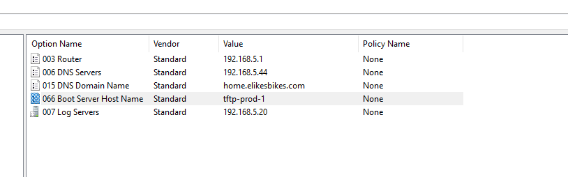

# Ansible to configure and update a ZTP server for use with Cisco ISR Routers

Sample project using Ansible to setup and manage a ZTP server for use Cisco ISR Routers

In this project you'll find:
- (1) **Introduction to ZTP** with Playbooks
- (2) Setting up DHCP Server
- (2) Severals **ansible roles** packaged and documented into [Ansible roles](roles) to configure DHCP server and to deploy configuration files on all remote ZTP servers (FTP).
- (3) **[Examples of ZTP configurations](conf)** files.
- (4) **Playbook to play with ZTP roles** and update ZTP in a more complex project.
- (5) A simple example playbook to configure a Mellanox Oynx-based network switch post-ZTP boot up.

# 1. Introduction to ZTP

Zero touch provisioning promises that you can install new devices without moving your hands. To someone who is used to connecting a console cable to each and every device this can seem like wondrous magic.

# 2. Setting up a Configuring TFTP on Windows Server

This project is managing the creation of a ZTP server running on Windows DHCP Serrvice
- `DHCP-Server` is used as part of the DHCP server to provide IP address on the management network.

will make another tutorial on how to set up a Windows DHCP Server. thought about for the purpose of this ZTP doing it on Linux, but since I already had a Windows AD server, I am using windows for now

All devices names, Ip addresses loopback addresses etc .. are defined in the [inventory file named "hosts"](hosts).

# 2. Playbooks

Available playbooks are listed below:

# 3. Variables

# 4. Contributing

# 5. Acknowledgement

This work is partially-based on initial work by elikesbikes ([GitHub respository](https://github.com/elikesbikes/tutorials/blob/main/network/zero-tp))