Join CentOS Stream 9 to an Active Directory Domain ➕Bash Script

efore We Start 👋🏾
It is recommended we configure the hostname of our CentOS server to include the name of the domain we are joining. (For example, CentOS9.domainname.com). We utilize the hostnamectl command to change both the static and transient hostname at the same time.

sudo hostnamectl set-hostname <Server FQDN>
📝NOTE: You may notice that the hostname has not changed within the shell prompt, but if you execute hostname -f, you will see that the hostname has indeed changed. A simple reboot will allow the correct hostname to display in the shell prompt if required.

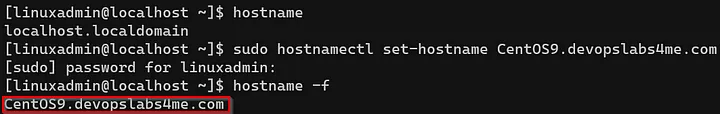

Hostname successfully updated
Step 1 — Install Realmd and Essential Packages 👩‍💻
Realm is a command line tool that allows us to manage enrollment in Kerberos realms, like Active Directory! Once we establish domain membership, we will proceed with leveraging the System Security Services Daemon (SSSD) client to perform the actual looks required for remote authentication. For more information on Realm and SSSD I have provided the following resource links. 🤓

Execute the following commands to install Realmd and required packages:

sudo yum update -y
sudo yum install -y realmd sssd oddjob oddjob-mkhomedir adcli samba-common-tools krb5-workstation authselect-compat

Step 2 — Join the Active Directory Domain 🤝
With the necessary packages installed, we can now Discover and Join the domain. If you are doing this in a lab environment, please do yourself a favor and make sure you CentOS server can resolve the domain name! If DNS isn’t configured properly you will be spinning your wheels at this step. 😋

To discover local domains:

realm discover

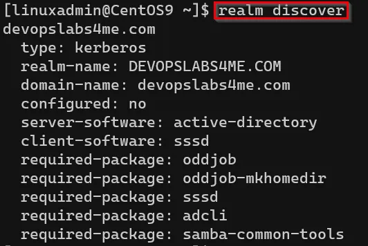

In order to join the CentOS server to Active Directory, we need to obtain the credentials 🔑 for an AD account that has the necessary permissions to add computers to the domain. In this example, I am using a domain administrator account.

To join the domain:

sudo realm join <domain name>  -U <domain administrator>

To confirm domain membership:

realm list

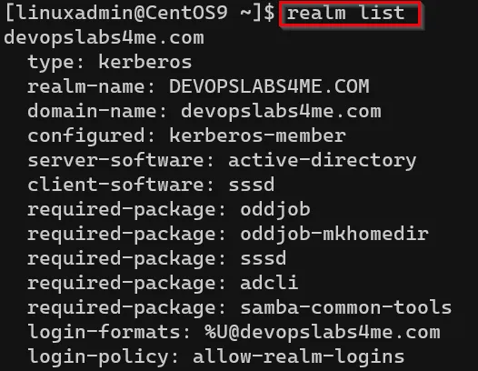

tep 3 — Configure the System Security Services Daemon (SSSD) ⚙️
SSSD comes installed with a default configuration file, /etc/sssd/sssd.conf. However, in my experience, it is best that we make a few adjustments to this configuration to allow seamless logins and Dynamic DNS (DDNS) updates. Enabling DDNS updates removes the overhead associated with having to manually maintain DDNS records on our Domain Controller/DNS server.

For example, if we change the IPv4 address of your CentOS server, we would have to manually update the A and PTR records in DNS to reflect those changes. I can’t think of one sysadmin that would want to do that every time a change is made👎. If you are curious about what your default sssd.conf file looks like, run the following command:

sudo cat /etc/sssd/sssd.conf

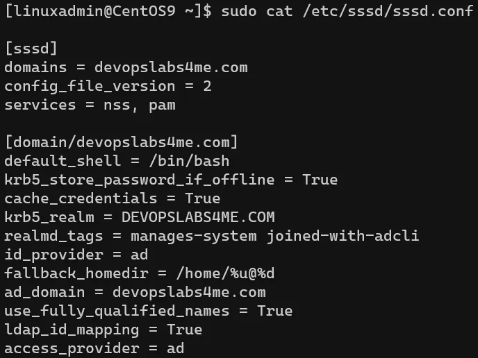

Now let’s move forward with modifying the sssd.conf to fine tune our configuration. In this example, we will use VIM to open the file, make our changes, and most importantly, SAVE those changes and close the file.

sudo vi /etc/sssd/sssd.conf
Once the vi text editor is open, type “gg” to move the cursor to the first line of the file (if not already there). Then type “dG” to delete all the lines or text in the file. Once all text has been removed, copy and past the text below.

You will also need to modify the specific domain name entries to match your environment by typing “i” to go into insert mode. Once in insert mode you can make your changes accordingly. After confirming your configuration file is now complete, press the “Esc” key, and enter “:wq” to save and close the file.

[sssd]
domains = <your Domain Name>
config_file_version = 2
services = nss, pam
default_domain_suffix = <your Domain Name>
[pam]
[domain/<your Domain Name>]
ad_domain = <your Domain Name>
krb5_realm = <your Domain Name>
realmd_tags = manages-system joined-with-samba 
cache_credentials = True
id_provider = ad
access_provider = ad
krb5_store_password_if_offline = True
default_shell = /bin/bash
ldap_id_mapping = True
use_fully_qualified_names = True
fallback_homedir = /home/%u@%d
dyndns_update = true
dyndns_update_ptr = true
dyndns_auth_ptr = GSS-TSIG
dyndns_auth = GSS-TSIG

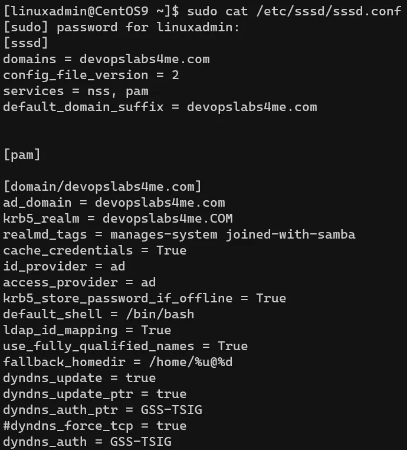

NOTE: In my environment, I am using secure only DDNS updates. This configuration only grants domain members the ability to update DNS records. For more information on DDNS check out the resource link below.

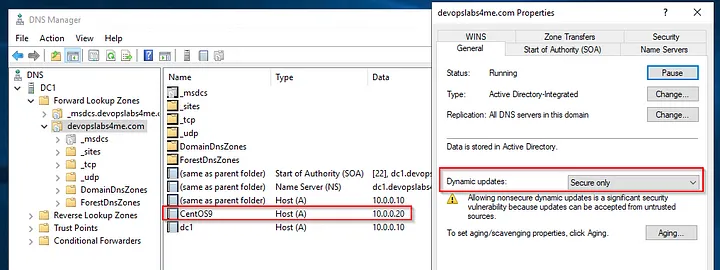

Step 4 — Restart SSSD and Test Login 👨‍💻
Finally, the moment we’ve been waiting for. After we restart the SSSD service, we can test SSH login to our CentOS server with an AD user account.

Restart SSSD:

sudo systemctl restart sssd
Check SSSD Status:

sudo systemctl status sssd

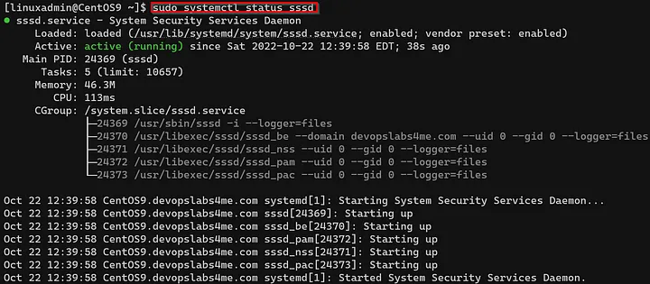

You may now proceed with logging in to your CentOS server with an AD account via SSH. In my environment, I used the domain administrator account to log into my CentOS server as shown below.

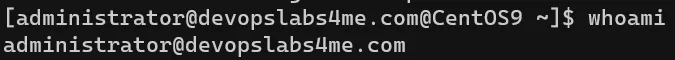

tep 5 — Restrict Logins to a Specific Group 🔒
You were probably thinking that this tutorial was over, but unfortunately, we still have a bit more work to do. We were able to confirm successful login with an AD account, but… any AD user can now log into our CentOS server! 😱

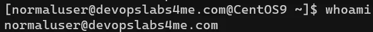

Don’t worry though, we can fine tune our configuration further to only allow a specific AD security group access to our server. In my example, I created a security group named TeamLinux and only the domain administrator and app developer AD accounts are members of this group.

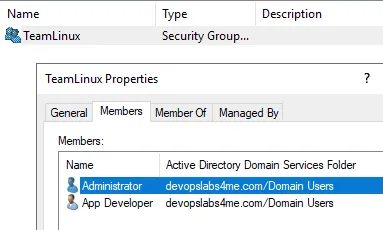

To allow a specific AD security group login permissions to our CentOS server:

sudo realm permit -g <security group name>
If you perform “sudo cat /etc/sssd/sssd.conf”, you will find a new entry with your security group for simple_allow_groups.

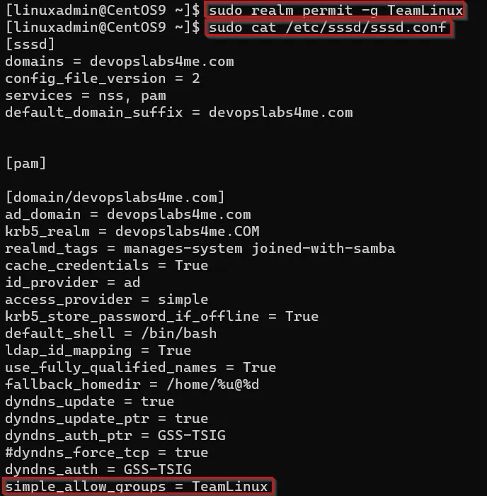

If you now attempt to SSH login with any AD user account that is not apart of your defined security group, the connection will be immediately terminated. 😎

In Conclusion
We have barely scratched the surface on how we can integrate Linux in an Active Directory domain, but I hope you are able to walk away from this tutorial with an understanding on how simple the process can be. I highly recommend creating a Red Hat user account and reading up on their documentation if you want to deploy something like this in production. All environments are different so make sure you adjust your setup accordingly.

As promised, I have provided a basic BASH script below that will enable you to join your CentOS 9 server to Active Directory via script. Don’t forget to set the execute permission bit and run the script with Sudo privileges. ☝️ I’m still in the early stages of developing BASH scripts so any constructive criticism is always welcomed!😊

#!/bin/bash
read -p "Does this server have a FQDN with a DNS suffix that matches the AD Domain you are joining? (yes or no) " update_name
if [ $update_name = "yes" ]
then 
 continue
elif [ $update_name = "no" ]
then 
 read -p "What's the new FQDN of the this server? " new_name
 hostnamectl set-hostname $new_name
else
 echo "You entered the wrong answer.  Choose Yes or No only."
 exit
fi
read -p "What is the name of the domain you are joining? " domain_name
yum update -y
yum install -y realmd sssd oddjob oddjob-mkhomedir adcli samba-common samba-common-tools krb5-workstation authselect-compat
read -p "What is the name of the AD account you will be using to join this server to the domain? " account
realm join $domain_name  -U $account
cat > /etc/sssd/sssd.conf << END
[sssd]
domains = $domain_name
config_file_version = 2
services = nss, pam
default_domain_suffix = $domain_name
[pam]
[domain/$domain_name]
ad_domain = $domain_name
krb5_realm = $domain_name
realmd_tags = manages-system joined-with-samba 
cache_credentials = True
id_provider = ad
access_provider = ad
krb5_store_password_if_offline = True
default_shell = /bin/bash
ldap_id_mapping = True
use_fully_qualified_names = True
fallback_homedir = /home/%u@%d
dyndns_update = true
dyndns_update_ptr = true
dyndns_auth_ptr = GSS-TSIG
dyndns_auth = GSS-TSIG
END
systemctl restart sssd
read -p "Do you want to lock down login access to a specific AD security group? (yes or no) " sg_yes_or_no
if [ $sg_yes_or_no = "yes" ]
then 
 read -p "What's the name of the security group? " sgname
 sudo realm permit -g $sgname
 systemctl status sssd
elif [ $sg_yes_or_no = "no" ]
then 
 systemctl status sssd
 exit
else
 systemctl status sssd
 echo "You have entered the wrong answer.  If you would like to lock down access please do so manually."
 exit
fi