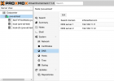
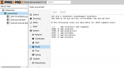
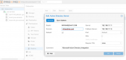
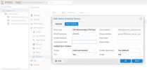
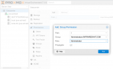

This tutorial will walk through the steps necessary to join your Proxmox server to Microsoft Active Directory on a Windows 2019 Server.
You will be able to sync your users and groups into the Proxmox Permissions Panel in the GUI, and log into the web console with active directory credentials.

Here are the general steps:
Set basic settings
Add Active Directory Realm & Sync Users
Configure Permissions
Install packages from the repository
Join the Active Directory domain
Test your config

In this tutorial, our realm/domain will be infraredhat.com
Two domain controllers have been configured, and are acting as DNS servers.
Our subnet is 192.168.11.0/24

The Proxmox node a single network interface with a static IP of 192.168.11.10/24
The Domain Controllers (and DNS servers) have IP's of 192.168.11.11 and 192.168.11.12.

Set the search domain to infraredhat.com, and set the DNS servers to the IP addresses of the Domain Controllers, 192.168.11.11 and 192.168.11.12.

Configure hosts file with your Proxmox server's FQDN (and hostname) following the example below.

Navigate to the "Time" panel below "Hosts" currently selected in the menu and verify the correct time and Time Zone.

Add Active Directory Server

Next, Select "Datacenter" or the name of your cluster, and Navigate to Permissions > Realms > Add Realm > Active Directory Server.
Populate your domain and domain controller IP's like the example below.

Click on the "Sync Options" Tab.
You'll need Active Directory credentials to access domain controller users and groups. You can simply use the Administrator Account, but for more security, you can create a user account with read-only access to the domains objects instead. For demonstration, let's use the built in "Administrator".

For the "Bind User", you'll need to enter it a very specific way.
Navigate to your domain controller and open a powershell window as admin.

SUPER IMPORTANT!!! (AND NOT VERY WELL DOCUMENTED!!!)

For the correct string to enter for the Adminstrator in the infraredhat.com domain, you would enter the following command:

Code:
dsquery user dc=infraredhat,dc=com -name Administrator

This is the output, and you can copy and paste it directly into the field, "Bind User"
Code:
CN=Administrator,CN=Users,DC=infraredhat,DC=com

Enter the password for this user. For now you can ignore the remainder of the fields. I've set my default sync preferences in the screenshot.

Click OK to close and save.
You can now select your Active Directly Realm from the list (listed alongside PAM and PVE). Click SYNC from the menu and you should see your AD Users and Groups populate.

Configure permissions to tell Proxmox what access to give each user/group

Next, Navigate to the "Permissions" Menu > Add > Group Permission
I've selected the Administrators Group from Active directory, and assigned the PVE Administrator Role to this Group.
This way, any user in the AD Administrator group will also be a PVE Administrator.
Select '/' to give full access as well.
Click OK.

Install additional packages needed for system security

Next, Navigate to a shell window on your PVE Node. There are a few packages to install and configure.
Update your packages, and install adcli, packagekit, samba-common-bin realmd
The remainder of the required packages will be auto-installed and configured.

Code:
apt update
apt dist-upgrade

# install the following packages (use apt list to see if they are needed)
apt install adcli packagekit samba-common-bin

# install realmd
apt install realmd

Join the node to the domain

Next, test connection with the domain controller, and then join the domain. For additional options, see the man pages by running the command man realm. Since we're doing a high level walkthrough, I'm keeping it simple. Because no user is specified in the join command, realmd defaults to "Administrator" for this action.

Code:
# test realmd
realm -v discover infraredhat.com

You'll see an output with information about your DC and domain, along with additional required packages. Installing these in advance will cause the configurations to fail. Simply enter this command, substituting your own domain.

Code:
#join the domain
realm -v join infraredhat.com

Follow the prompts, enter the Active Directory Admin password when prompted and allow the sssd and additional packages install.
You are now joined to the domain and you should see your Proxmox node appear as a computer in Active Directory Users and Computers. Congrats!

Configure additional settings and test your config

You can edit the config in /etc/sssd/sssd.conf. Run
Code:
pam-auth-update
and select the appropriate option if you would like home directories created for AD users. There is more information available on the internet about sssd.conf. Test your configuration with the command
Code:
id administrator@infraredhat.com
- you should see UID and GID from your domain controller.

Finally, log out of Proxmox in the menu in the upper right hand corner, and test by logging in as Administrator@infraredhat.com in the login menu by selecting the Active Directory domain from the login drop-down instead of PAM. You should successfully authenticate and log in. Beware, you will not have shell access to Proxmox in the console... that's only available to root, logged in under local PAM. For shell access, you'll need to configure ssh separately.